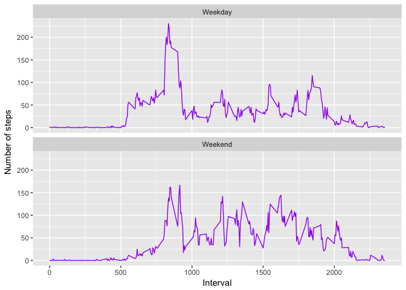

# Reproducible Research: Peer Assessment 1


## Loading and preprocessing the data
First of all, make sure that you are in the right working directory / set your working directory.

```r
getwd()
```

```
## [1] "/Users/heikehv/datasciencecoursera/datasciencecoursera/Reproducible_Research/RepData_PeerAssessment1"
```

```r
setwd("~/datasciencecoursera/datasciencecoursera/Reproducible_Research/RepData_PeerAssessment1")
```
and read in your file (it is presumed you downloaded it and saved it in your working directory)

```r
activity <- read.csv("activity.csv", header=TRUE, sep=",")
```
check your data and change date format

```r
str(activity)
```

```
## 'data.frame':	17568 obs. of  3 variables:
##  $ steps   : int  NA NA NA NA NA NA NA NA NA NA ...
##  $ date    : Factor w/ 61 levels "01/10/2012","01/11/2012",..: 1 1 1 1 1 1 1 1 1 1 ...
##  $ interval: int  0 5 10 15 20 25 30 35 40 45 ...
```

```r
activity$date <- as.Date(as.character(activity$date), "%d/%m/%Y")
summary(activity)
```

```
##      steps             date               interval     
##  Min.   :  0.00   Min.   :2012-10-01   Min.   :   0.0  
##  1st Qu.:  0.00   1st Qu.:2012-10-16   1st Qu.: 588.8  
##  Median :  0.00   Median :2012-10-31   Median :1177.5  
##  Mean   : 37.38   Mean   :2012-10-31   Mean   :1177.5  
##  3rd Qu.: 12.00   3rd Qu.:2012-11-15   3rd Qu.:1766.2  
##  Max.   :806.00   Max.   :2012-11-30   Max.   :2355.0  
##  NA's   :2304
```

```r
head(activity)
```

```
##   steps       date interval
## 1    NA 2012-10-01        0
## 2    NA 2012-10-01        5
## 3    NA 2012-10-01       10
## 4    NA 2012-10-01       15
## 5    NA 2012-10-01       20
## 6    NA 2012-10-01       25
```
check the date range and load necessary libraries

```r
range(activity$date)
```

```
## [1] "2012-10-01" "2012-11-30"
```

```r
library(ggplot2)
```
## What is mean total number of steps taken per day?
Summing up steps taken each day (ignoring NAs as instructed) and using base plotting to plot them to a histogram (setting breaks to 50 to get enough detail / variety).

```r
steps_per_day <- aggregate(steps ~ date, activity, sum)
hist(steps_per_day$steps, breaks = 50, main="Histogram of Steps Taken per Day", xlab="Number of Steps taken per day", col="purple")
```

<!-- -->

## Mean and median number of steps taken each day
We could use summary to get the mean and medium, but using mean() and medium() is more accurate

```r
MeanSteps <- mean(steps_per_day$steps, na.rm=TRUE)
MeanSteps
```

```
## [1] 10766.19
```

```r
MedianSteps <- median(steps_per_day$steps, na.rm=TRUE)
MedianSteps
```

```
## [1] 10765
```
This shows that the mean number (average) of steps is 10766.19 and the median is 10765.

## What is the average daily activity pattern?
First task:
- Plot a linegraph to show the average of steps over 5min Intervals
- Find the 5-minute interval that, on average, contains the maximum number of steps

```r
IntervalSteps <- aggregate(steps~interval, activity, mean)
ggplot(IntervalSteps, aes(x=interval, y=steps)) + geom_line(color="brown", size=.5) + labs(title="Average Daily Activity Pattern", x="Interval", y="Number of steps")
```

<!-- -->

```r
MaxS <- IntervalSteps$interval[which.max(IntervalSteps$steps)]
MaxS
```

```
## [1] 835
```
Interval no 835 is the one with most number of steps.

## Imputing missing values
Calculate and report the total number of missing values in the dataset (i.e. the total number of rows with 𝙽𝙰s)

```r
missing_data <- sum(is.na(activity))
missing_data
```

```
## [1] 2304
```
The total number of missing values is 2304 (which we already saw from using summary() above).

Devise a strategy for filling in all of the missing values in the dataset and create a new dataset that is equal to the original dataset but with the missing data filled in.
First I create a duplicate of the dataset and a list of all NAs. Using tapply(), I fill in the missing values in the steps column with the avg per 5min interval:

```r
activity_nona <- activity
nonas <-is.na(activity_nona$steps)
avg_interval <- tapply(activity_nona$steps, activity_nona$interval, mean, na.rm=TRUE, simplify=TRUE)
activity_nona$steps[nonas] <- avg_interval[as.character(activity_nona$interval[nonas])]
```
Make a histogram of the total number of steps taken each day and calculate and report the mean and median total number of steps taken per day. Do these values differ from the estimates from the first part of the assignment? What is the impact of imputing missing data on the estimates of the total daily number of steps?
As before, using aggregate() to calculate total number of steps per day and using hist() to plot a simple histogram

```r
steps_per_day_nonas <- aggregate(steps ~ date, activity_nona, sum)
hist(steps_per_day_nonas$steps, breaks = 50, main="Histogram of Steps Taken per Day", xlab="Number of Steps taken per day", col="pink")
```

<!-- -->

```r
MeanStepsnonas<- mean(steps_per_day_nonas$steps)
MeanStepsnonas
```

```
## [1] 10766.19
```

```r
MedianStepsnonas<- median(steps_per_day_nonas$steps)
MedianStepsnonas
```

```
## [1] 10766.19
```
Both Mean and Median are now the same number, 10766.19. So by adding the average steps per interval, the median has slighly increased, while the mean stays the same.

## Are there differences in activity patterns between weekdays and weekends?
First of all I added the weekdays to the dates using the weekdays() function. With a simple if/else statement I then assigned either the term weekend or weekday to the respective dates. All of this is stored in a new column $days which is turned into a factor with as.factor().

```r
activity_nona$days <- weekdays(activity_nona$date)
for(i in 1:length(activity_nona$days)) 
  {if(activity_nona$days[i] %in% c("Saturday", "Sunday")) activity_nona$days[i] = "Weekend"
 else activity_nona$days[i] = "Weekday" }
activity_nona$days <- as.factor(activity_nona$days)
```
To build the plot for showing activity on weekdays and weekends, I first calculated the average steps taken and then used ggplot to plot both possibilities using facet_wrap()

```r
avgsteps <- aggregate(steps ~ interval + days, data = activity_nona, mean)
ggplot(avgsteps, aes(x = interval, y = steps)) + geom_line(color = "purple")+ labs(x = "Interval", y = "Number of steps")  + facet_wrap( ~ days, nrow=2, ncol=1)
```

<!-- -->
